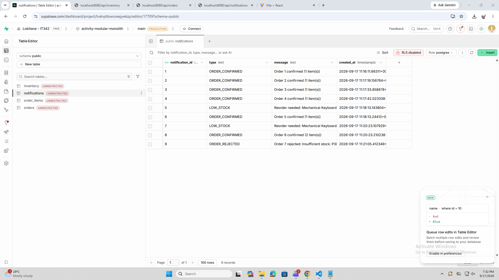
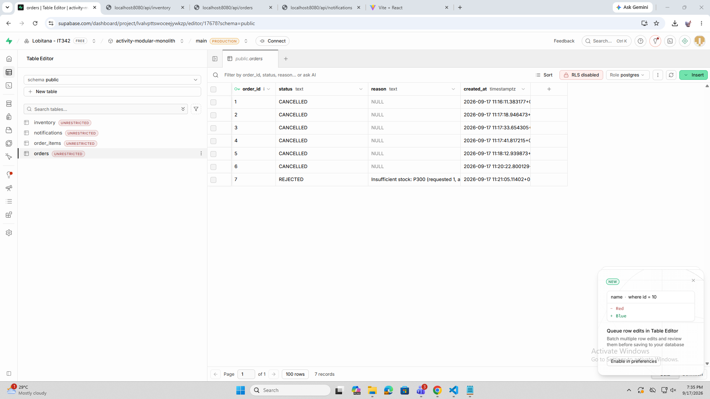
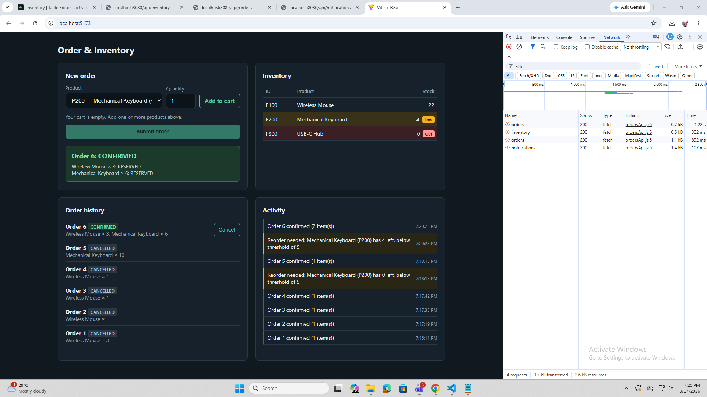
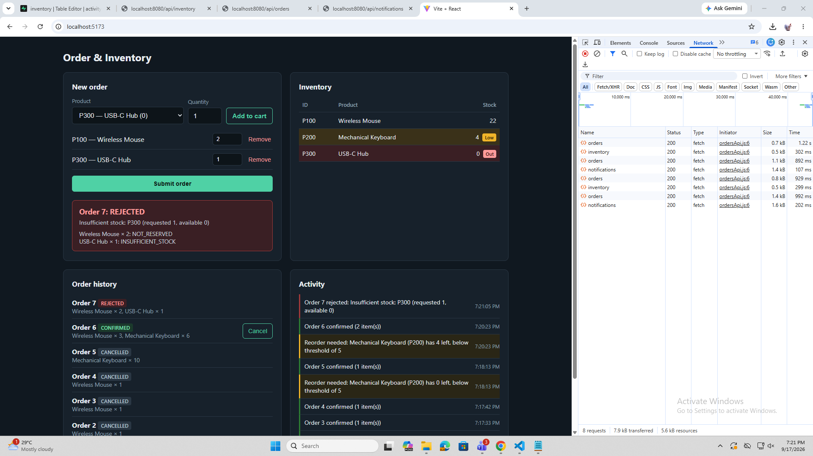
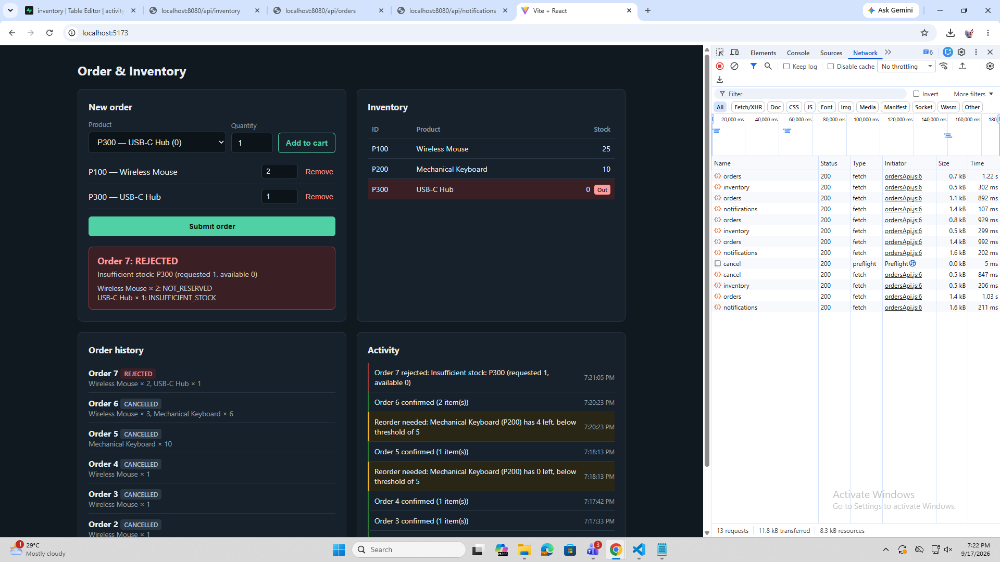
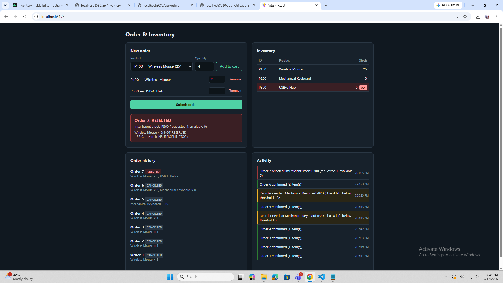

# Modular Monolith Integration — Order, Inventory & Notification

A single Spring Boot application with three in-process modules — **Order**, **Inventory** and **Notification** — sharing a Supabase (Postgres) database, connected to a React frontend over REST.

Lab 2 extends the Lab 1 monolith with multi-item orders (all-or-nothing), order cancellation with restock, read endpoints for a live dashboard, in-monolith domain events, and a low-stock alert rule.

## Architecture

```
edu.cit.lobitana/
  ModularmonolithApplication.java   (parent package — scans all modules)
  config/
    CorsConfig.java
  inventory/
    Inventory.java                  (entity)
    InventoryRepository.java        (JPA repository)
    InventoryService.java           (public interface: getAll, getItem, reserve, restock, isLowStock)
    InventoryServiceImpl.java       (package-private implementation, publishes LowStockEvent)
    InventoryController.java        (GET /api/inventory)
    InventoryView.java              (API response record)
    events/LowStockEvent.java
  shop/
    Order.java                      (entity, one-to-many line items)
    OrderItem.java                  (entity for order_items)
    OrderRepository.java
    OrderService.java               (validates all items, reserves, cancels, publishes order events)
    OrderController.java            (POST /api/orders, GET /api/orders, POST /api/orders/{id}/cancel)
    OrderDtos.java                  (request/response records)
    events/OrderPlacedEvent.java
    events/OrderRejectedEvent.java
  notification/
    Notification.java               (entity)
    NotificationRepository.java
    NotificationListener.java       (@EventListener for all three events)
    NotificationController.java     (GET /api/notifications)
```

**Module boundaries**

- `shop` depends only on the public `InventoryService` interface (constructor injection). `InventoryServiceImpl` stays package-private.
- `notification` imports **only the event records** from `shop.events` and `inventory.events`. It never calls `OrderService` or `InventoryService`.
- Neither `shop` nor `inventory` imports anything from `notification`. They publish events through Spring's `ApplicationEventPublisher` and do not know who listens.

## Tech Stack

- Backend: Spring Boot 4 (Java 17, Maven, Spring Data JPA)
- Frontend: React + Vite
- Database: Supabase (Postgres)

## Supabase Setup

1. Create a free account and project at [supabase.com](https://supabase.com).
2. Open **Connect → Session pooler** to get your host and username. The session pooler is recommended over Direct connection, which uses IPv6 by default.
3. Open the **SQL Editor**, paste the contents of [`sql/schema.sql`](./sql/schema.sql), and run it. Choose **"Run without RLS"** when prompted: the app connects with a privileged database credential, not Supabase's public client API. The script drops and recreates every table, so it can be re-run to reset the data.
4. Confirm in **Table Editor** that there are four tables: `inventory` with 3 seeded rows (P100 Wireless Mouse 25, P200 Mechanical Keyboard 10, P300 USB-C Hub 0), plus empty `orders`, `order_items` and `notifications`.



## Database Schema

| Table | Columns |
|---|---|
| `inventory` | `product_id`, `name`, `stock` |
| `orders` | `order_id`, `status` (`CONFIRMED` / `REJECTED` / `CANCELLED`), `reason`, `created_at` |
| `order_items` | `order_item_id`, `order_id`, `product_id`, `quantity` |
| `notifications` | `notification_id`, `type` (`ORDER_CONFIRMED` / `ORDER_REJECTED` / `LOW_STOCK`), `message`, `created_at` |

## Backend Setup

1. Set your Supabase database password as the environment variable `SUPABASE_DB_PASSWORD`. **Never commit this value to Git.**
   - IntelliJ: Run/Debug Configurations → Environment variables
   - PowerShell: `$env:SUPABASE_DB_PASSWORD='your-password'`
2. Update `src/main/resources/application.properties` with your own Supabase host and username:
   ```properties
   spring.datasource.url=jdbc:postgresql://<your-pooler-host>:5432/postgres
   spring.datasource.username=<your-pooler-username>
   spring.datasource.password=${SUPABASE_DB_PASSWORD}
   inventory.low-stock-threshold=5
   ```
3. Run the app:
   ```
   cd backend
   .\mvnw spring-boot:run
   ```
4. The API is available at `http://localhost:8080`.

## Frontend Setup

```
cd frontend
npm install
npm run dev
```

Opens at `http://localhost:5173`, which the backend's CORS config allows. The page has a cart, an inventory table that highlights low-stock rows, an order history with Cancel buttons, and an activity feed. All panels refresh after every order and cancel.

## API

| Method | Endpoint | Request Body | Response |
|---|---|---|---|
| POST | `/api/orders` | `{ "items": [{ "productId": "P100", "quantity": 3 }, ...] }` | `{ orderId, status, reason, items: [{ productId, quantity, outcome }], inventory }` |
| GET | `/api/orders` | — | Order history with status and line items |
| POST | `/api/orders/{orderId}/cancel` | — | The cancelled order. `404` if not found, `409` if already `CANCELLED` or `REJECTED` |
| GET | `/api/inventory` | — | `[{ productId, name, stock, lowStock }]` |
| GET | `/api/notifications` | — | Notification log, newest first |

Item outcomes are `RESERVED`, `INSUFFICIENT_STOCK`, or `NOT_RESERVED` (the item had enough stock, but another item in the same order failed).

## How the New Features Work

**Multi-item orders (all-or-nothing).** `OrderService.placeOrder()` runs in one `@Transactional` method. It first checks every line item against current stock without changing anything. If any item fails, the order is saved as `REJECTED`, `reserve()` is never called, and the response marks the failing item `INSUFFICIENT_STOCK` and the rest `NOT_RESERVED`. Only when every item passes does it call `reserve()` for each one. If a reserve still fails (for example, stock changed in between), the method throws and the whole transaction rolls back.

**Cancellation and restock.** `POST /api/orders/{id}/cancel` calls `InventoryService.restock()` for every line item and sets the status to `CANCELLED`. Rejected orders return `409`, because they never reserved stock and restocking them would create stock that doesn't exist.

**Domain events.** After confirming or rejecting an order, `OrderService` publishes `OrderPlacedEvent` or `OrderRejectedEvent`. After a successful `reserve()`, `InventoryServiceImpl` publishes `LowStockEvent` if remaining stock is below the threshold (5). `NotificationListener` handles all three with `@EventListener` and writes to the `notifications` table, logging low-stock alerts as a separate `LOW_STOCK` type.

### Synchronous vs. @Async listeners

None of the listeners are `@Async`. They run synchronously on the request thread, inside the order's transaction. This has two benefits for this lab: a notification is only saved if the order commits, and the activity feed is already up to date when the frontend refreshes right after the request. With `@Async`, the listener would run on another thread outside the transaction, so it could log an order that later rolled back, and a failure while saving the notification would go unnoticed. If asynchronous processing were needed later, I would combine `@Async` with `@TransactionalEventListener(phase = AFTER_COMMIT)` so notifications are only sent for committed orders.

## Network Tab Evidence

### 1. Multi-item order — all items succeed (CONFIRMED)

Wireless Mouse × 3 and Mechanical Keyboard × 6. Both items are `RESERVED`, and the keyboard drops to 4, which triggers a low-stock alert.



### 2. Multi-item order — one item fails, whole order REJECTED

Wireless Mouse × 2 and USB-C Hub × 1. The hub has 0 stock, so the order is rejected. The mouse is `NOT_RESERVED` and its stock stays at 22, so nothing was partially reserved.



### 3. Cancel with restock reflected in GET /api/inventory

Cancelling the confirmed order returns both items to stock: Wireless Mouse back to 25 and Mechanical Keyboard back to 10.



### 4. Notification feed — confirmed order, rejected order, and low-stock alert



## Reflection

### 1. Keeping multi-item orders atomic

Working on this project helped me understand the importance of transaction management in maintaining data consistency. Since Order and Inventory run within the same application and database, using a single @Transactional method allows all stock reservations to succeed or fail together. Validating every item before making reservations also helps prevent unnecessary database changes. However, if Inventory becomes a separate microservice, a shared database transaction would no longer be possible. I would need to implement a saga with compensating actions, such as restocking items when a reservation fails. Idempotency keys, timeouts, and an outbox pattern would also be necessary to handle retries and prevent inconsistent inventory.

### 2. Events instead of calling Notification directly

Another lesson I learned is the value of event-driven communication. Instead of directly calling Notification, OrderService can publish events without knowing which modules will consume them. This reduces coupling and makes the system easier to extend. However, I realized that in-process events are still synchronous and can participate in the same transaction. If Notification becomes a separate service, I would need a message broker such as RabbitMQ or Kafka, along with a transactional outbox to ensure that events are published reliably. Consumers must also handle duplicate messages safely.

### 3. Which module to extract first

Among the modules, I would choose Notification as the first module to extract into a separate microservice. It has fewer dependencies, owns its own data, and does not directly affect order processing when unavailable. Moving it into a separate Spring Boot application would allow it to operate independently while communicating through a message broker. To do this, I would move the notification package and its table into a new Spring Boot project and share the event classes as a small library. In the monolith, ApplicationEventPublisher would be replaced with code that sends events to the broker, and in the new service, @EventListener would become a broker listener such as @RabbitListener or @KafkaListener. The frontend would then call the new service for GET /api/notifications. Meanwhile, keeping Order and Inventory together would avoid introducing distributed transaction challenges too early.